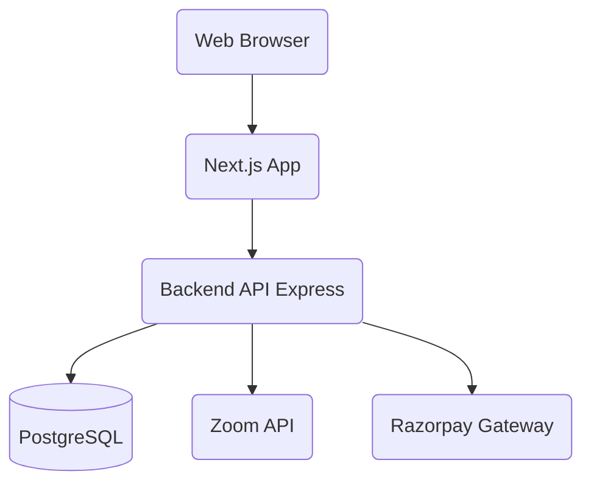

# System Architecture

```mermaid
graph TD
    Client(Web Browser) --> Frontend(Next.js App)
    Frontend --> API(Backend API Express)
    API --> DB[(PostgreSQL)]
    API --> Zoom(Zoom API)
    API --> Razorpay(Razorpay Gateway)
```

## Components
- **Frontend**: App router, Tailwind styling.
- **Backend**: RESTful API endpoints.
- **Database**: Relational data model for users and courses.