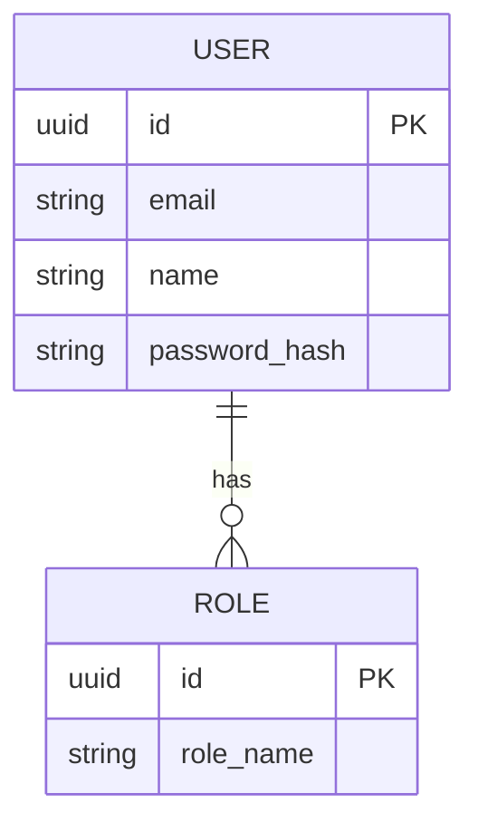

# Database Schema

```mermaid
erDiagram
    USER ||--o{ ROLE : has
    USER {
        uuid id PK
        string email
        string name
        string password_hash
    }
    ROLE {
        uuid id PK
        string role_name
    }
```
